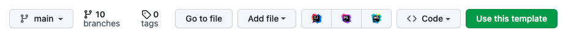

# NestJS Starter

This is a template repo for new APIs written in NestJS.

To use this as a template for a new repo, press the "Use this template" button located in the upper right corner of your GitHub repo:


## Set Up Your New Repo

Use the following steps to finish setting up your repo after generating from the template.

#### Replace Placeholder Variables and Descriptions

1. Replace `REPLACE_APPLICATION_NAME` with your actual application name in all files using underscores (ex. some_random_api).
2. Replace `REPLACE-APPLICATION-NAME` with your actual application name in all files using kebabcase (ex. some-random-api).
3. Replace `REPLACE APPLICATION NAME` with your actual application name in all files with spaces allowed (ex. Some Random API).
4. Replace `REPLACE_JWT_PERMISSIONS` with real permissions (e.g. `cardmatch-api:read`).
5. Replace `REPLACE_DOCS_DESCRIPTION`.
6. Replace `REPLACE_GITHUB_ORG` with the GitHub org that this repo falls under.

#### GitHub Setup

1. Check that `.github/CODEOWNERS` has correct team(s) listed. This ensures that the correct people are notified when changes are made to the repo.

1. Update your repo's settings in GitHub. On GitHub, click on "Settings." You should see a page with a menu like the one shown below.
   1. Click on "Collaborators and teams." Make sure that desired teams are listed with correct permissions, with Admin permissions for the team taking ownership.
   2. Under "Branches," update branch protection rules.
1. Set up autolinking so that it's easier to link JIRA tickets
   1. Go to "Autolink references"
   1. Set the "Reference prefix". This should be the JIRA ticket prefix (everything except the number). For example: `STACK-`
   1. Set the "Target URL" to the correct path. Replace the ticket number with `<num>` as explained in the docs. For example: `https://redventures.atlassian.net/browse/STACK-<num>`
   1. You should now be able to reference tickets in PRs and comments that will autolink to the appropriate JIRA ticket just my mentioning it! For example: `STACK-123`


#### Circle Setup

1. Uncomment the `build-docs` job and the `requires` under the `publish-docs` job in the `.circleci/config.yml` workflow. `.circleci/config.yml` tells Circle, our CI/CD platform, what to do --including tests, builds, publish docs, etc.
2. Register your repo in [Circle](https://app.circle.com). Since we already have our `.circleci/config.yml` file, you should be prompted to finish setting up your app in Circle once you log in.

#### Swagger Setup

1. Ensure Swagger is working as expected. While on the VPN, go to `localhost:3000/api-docs`. (Note: `3000` is the port your app is listening on. Both the port and the path to the Swagger documentation are defined in [main.ts](./src/main.ts).)
2. **AFTER** merging your changes into the main branch, follow Swagger API setup steps, found [here](https://github.com/CreditCardsCom/cards-rev-docs) and [here](https://github.com/CreditCardsCom/terraform-live/blob/master/applications/cards_api_docs/README.md).

#### Miscellaneous

1. Review `.dockerignore`. This file should include all of the files in the repo that Docker doesn't need or care about.
2. OPTIONAL: Update K6 config for relevant load testing if usage numbers are known.

#### Update README

1. Replace this README with README-template and fill out the links. Once completed, delete README-template. Some things to note:
   1. Developer docs, User guide, and Runbook can stay the same. On the Runbook page, add a heading for your application.
   2. For the ServiceNow page, you'll need to register your app [here](https://redventures.service-now.com/sp?id=sc_cat_item&sys_id=b847a365db1458d0e987e3a84b9619e2). Replace `SNOW-APP-ID` with your app's ID (begins with BAPP). Replace `please-replace-me-or-i-suffer` with the app's SNOW link, as found by clicking on your app in [this table](https://redventures.service-now.com/sp?spa=1&table=cmdb_ci_business_app&id=my_applications&filter=&p=1&o=number&d=asc). The link you want is the URL.
      

#### Terraform

Next let's set up ECR so that we have somewhere to publish our releases!

> **Note**
> This template is designed for either the CCDC **_or_** Bankrate AWS account. **YOU DO NOT NEED BOTH**
>
> - For CCDC: [The Credit Cards Way](#the-credit-cards-way)
> - For Bankrate: [The Bankrate Way](#the-bankrate-way)

<details>
<summary>

##### The Credit Cards Way

</summary>

1. Delete the entire `infrastructure` folder in this repo (that's for Bankrate!).
2. Clone and navigate to the `terraform-live` repo.

   ```sh
   git clone git@github.com:CreditCardsCom/terraform-live.git
   ```

3. Follow the `terraform-live` [documentation](https://github.com/CreditCardsCom/terraform-live/blob/master/README.md#generate-an-ecr-repository) to generate the terraform. TL;DR:

4. Make sure to update the `ServiceNowAppID` to the `SNOW-APP-ID` you created in the [step above](#update-readme).
5. Follow the [Atlantis documentation](https://github.com/CreditCardsCom/terraform-live/blob/master/README.md#atlantis) to validate and apply your changes.

</details>

<details>
<summary>

##### The Bankrate Way

</summary>

1. Clone and navigate to the `core-tfe-workspaces` repo.

   ```sh
   git clone git@github.com:bankrate/core-tfe-workspaces.git
   ```

2. Follow the steps in the [readme](https://github.com/bankrate/core-tfe-workspaces/blob/main/README.md) to get your Workspace set up in Terraform Cloud.
   1. TL;DR: Find your team's sub-directory in the `core-tfe-workspaces` repo. Navigate to `workspaces.tf` in that sub-directory and add a module for your new app. Then, open a PR with your changes. Once this PR is approved, Github will run `terraform plan` for you. When you're satisfied with your changes, run `terraform apply`. This Terraforms the Terraform so that you now have a Workspace for _your_ app's Terraform!
   2. You can confirm your Workspace is all set up on the [Terraform Console](https://app.terraform.io/app/bankrate/workspaces). You may need to request access on [ServiceNow](https://redventures.service-now.com/sp/?id=sc_cat_item&sys_id=bfea14b5dbe31454e987e3a84b9619fd).
3. Back in your codebase, go to [init.tf](./infrastructure/terraform/init.tf) and update all the instances of `change-me` to your application, team, etc. (e.g., `"some-project-name"`). You may also need to update the tags `DataClassification`, `ResiliencyTier`, and `Access`.
4. In [remote.tf](./infrastructure/terraform/remote.tf), update the `prefix` value from `change-me` to your application name (e.g., `"some-app-name-"`).
5. In [task-definition.tpl](./infrastructure/terraform/templates/task-definition.tpl), update the `image` value (line 5). You should change this value from `change-me` to your application name (e.g., `"some-app-name-"`).
6. Run `terraform init` and `terraform plan`. If everything looks good, run `terraform apply`!
</details>

## That's It!

Don't forget to complete the steps you need to do **AFTER** you merge to main! Those steps are listed again here for reference:

1. Ensure tests are running in Circle on the Main branch.
2. Register app with Galaxy.
3. Follow Swagger API docs setup steps.

## Components

- NestJS app created via `nest new`
- [NestJS shared library](https://github.com/CreditCardsCom/nestjs-shared)
- Custom TypeScript config (tsconfig.json, tsconfig.build.json)
  - esModuleInterop and strict
  - Exclude `scripts/` from build
- Swagger plugin added to `nest-cli.json`
- Jest config in `package.json`
  - Additional reporters for CircleCI
- [Config Module](docs/dev/configmodule.md)
- New Relic APM config
- Hosted Swagger docs on local
- Publish Swagger docs on build with `build-docs.ts`
- k6 load testing config in test/load-testing with example .env
- Example .env for configuration
- VS Code settings file for debugging
- CircleCI config
- Custom ESLint config
- Custom Prettier config and import sort config in package.json
- .gitallowed for Credible
- Health Controller for load balancer health checks
