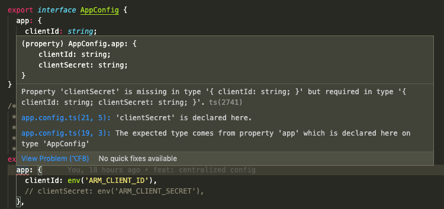

# Configuration

In order to make app configuration easier to locate and maintain, everything is centralized in: `src/config`.

```
src
└─ config
  ├─ app.config.ts          // contains the main config object and associated types
  ├─ validation.schema.ts   // rules we enforce on environment variables on app start
  ├─ config.service.ts      // sets up the primary getter
  ├─ config.module.ts       // puts everything together
  └─ util
      └─ env.ts             // helper method that makes pulling env vars easier
```

## Adding Config

The main configuration object can be found in `src/config/app.config.ts`. Configuration should be logically separated with TypeScript interfaces defining the structure. This structure has several advantages:

1. Configuration structure can be enforced in development via TypeScript.

   

1. Enables type hinting that makes it easier to find what you need.

   

1. Allows you to pull in parts of the configuration at once using destructuring.

   ```js
   const { rvmn: { api: rvmnApiConfig } } = this.appConfig.config;

   console.log('EXTREME DESTRUCTURING:', rvmnApiConfig);
   ```

1. This still utilizes the NestJS ConfigService so any libraries or modules that rely on it can continue to use it.

   ```js
   const appConfig = this.configService.get('config.app');
   ```

   **NOTE:** THIS IS NOT RECOMMENDED and is only intended for 3rd party libs that expect `ConfigService` to be injected. If you're using `ConfigService` directly there's probably a better way.

### Assumptions

#### Everything in the configuration object MUST be defined by app start

Due to some constraints around TypeScript and how we need to register the app for `ConfigService`, it is always assumed that every key in the object will resolve to a value on app start. This means that if we intentionally don't provide a [default value](#env-helper) (for client IDs and secrets, for example), we MUST require they be set at app start. See the [Validation on App Start](#validation-on-app-start) section below on how to do this.

#### `AppConfigService` must be imported instead of `ConfigService`

```js
export class TestModule {
  constructor(
    private appConfig: AppConfigService,
    // private configService: ConfigService,
  ) {}
}
```

`ConfigService` is available to be imported (and WILL work), but it is not recommended.

### ENV Helper

The [env helper](../../src/config/util/env.ts) is a utility that makes it easier to pull environment variables into the configuration object. By default, it will return an **empty string** if the requested environment variable doesn't exist. You can also provide a second parameter to serve as a default. **_Defaults should be something safe to commit to GitHub._**

```js
  env('SOMETHING_THAT_DOES_NOT_EXIST')                  // returns '' (empty string)
  env('SOMETHING_THAT_DOES_NOT_EXIST', 'safe default')  // returns 'safe default'
  env('SOMETHING_THAT_EXISTS', 'safe default')          // returns the value of SOMETHING_THAT_EXISTS
```

## Validation on App Start

As mentioned above, we have a need to require environment variables on app start. For an example, we may not want the app to start if `CLIENT_SECRET` hasn't been defined in either the local `.env` _OR_ via terraform/chamber on QA/Staging/Production. You can set these rules in the [validation schema](../../src/config/validation.schema.ts).

### Defining Rules

We utilize [joi](https://joi.dev/api/?v=17.4.0#example) to enforce validation rules. Since environment variables can ONLY be a string, rules will typically begin with `Joi.string()`. In addition, the [env helper](#env-helper) always returns a string to make defining config easier, so the only way to enforce the requirement of an environment variable is through these rules.

```js
export const validationSchema: ObjectSchema = Joi.object({
  ...

  // SESSION_KEY is required and must be at least 10 alphanumeric characters
  SESSION_KEY: Joi.string().alphanum().min(10).required(),

  ...
})
```

We use the `ValidationHelpers` class to house any custom rules or helpers to make them easier to reuse and test.

```js
export class ValidationHelpers {
  ...

  static requiredRandomToken: StringSchema = Joi.string().alphanum().min(10).required(),

  ...
}

export const validationSchema: ObjectSchema = Joi.object({
  ...

  // SESSION_KEY is required and must be at least 10 alphanumeric characters
  SESSION_KEY: ValidationHelpers.requiredRandomToken,

  ...
})
```

### Unit Testing Validation Rules

Unit tests for our validation rules can be found in [`src/config/validation.schema.spec.ts`](../../src/config/validation.schema.spec.ts). A test should generally flow as follows:

1. Create a mock schema to use your rule with any prerequisites.
1. Test the mock environment variable using `Joi.string().validate()`.
1. Verify any expectations.

> Tip: The `requiredIfNotInTest` unit tests provide a good example of preparing your mock schema for tests as they require a prerequisite of `NODE_ENV` being defined.
